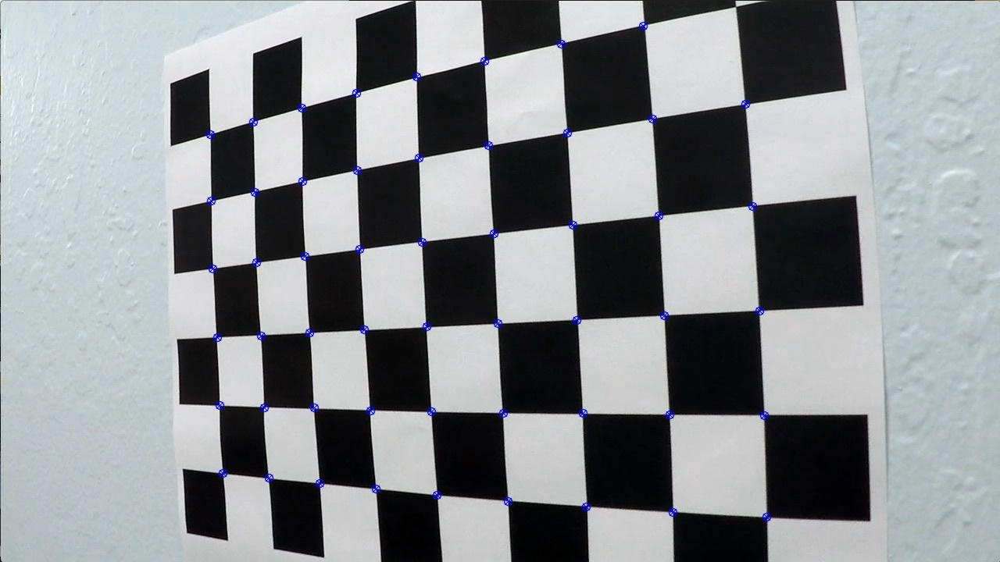
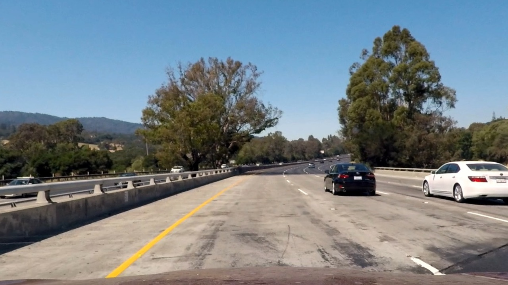
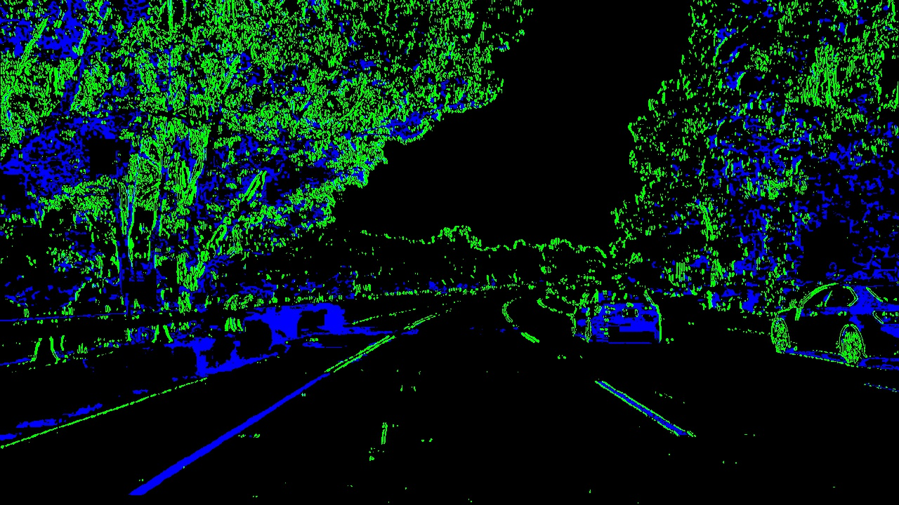
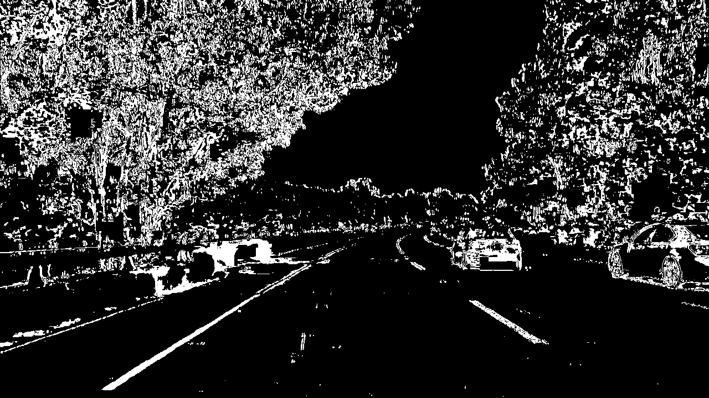
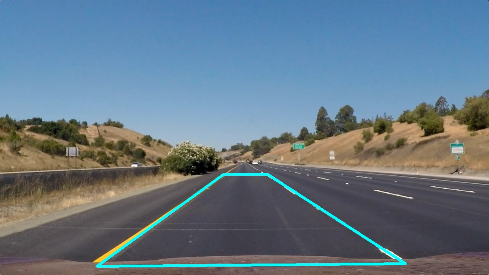
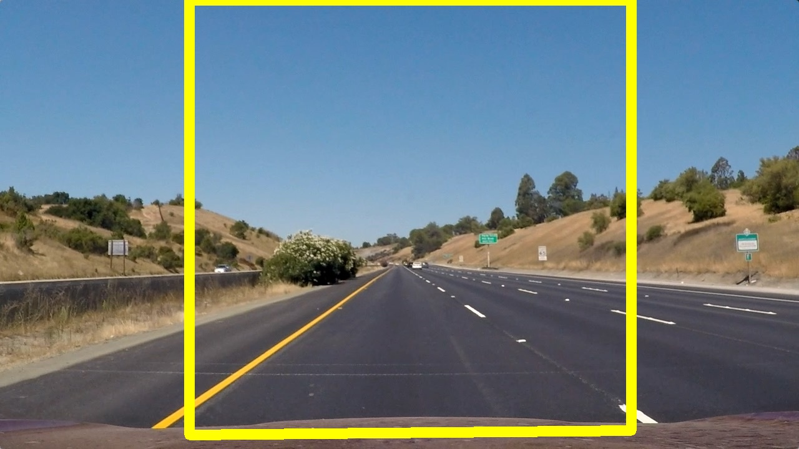
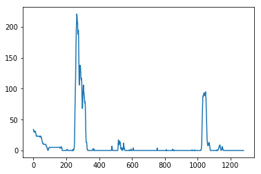
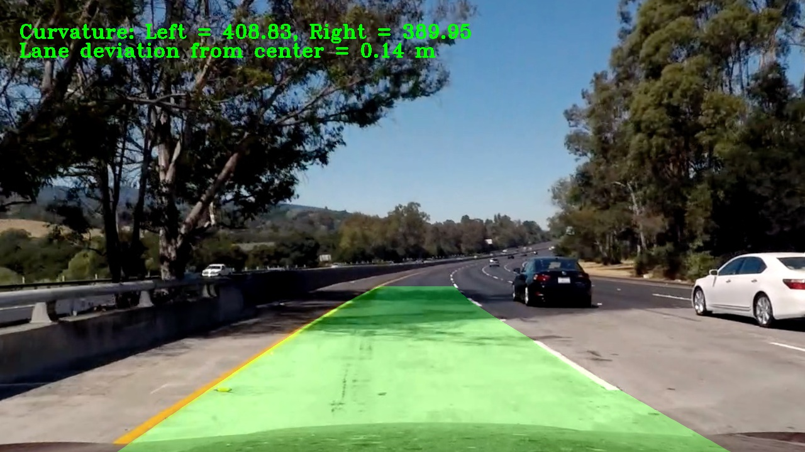

# Advanced Lane Finding Project Writeup

The goals / steps of this project are the following:

- Compute the camera calibration matrix and distortion coefficients given a set of chessboard images.
- Apply a distortion correction to raw images.
- Use color transforms, gradients, etc., to create a thresholded binary image.
- Apply a perspective transform to rectify binary image ("birds-eye view").
- Detect lane pixels and fit to find the lane boundary.
- Determine the curvature of the lane and vehicle position with respect to center.
- Warp the detected lane boundaries back onto the original image.
- Output visual display of the lane boundaries and numerical estimation of lane curvature and vehicle position.

You can find the code for this project at: https://codynicholson.github.io/Advanced_Lane_Line_Finding_Project/

You can find the video output file for this project at "./output_files/project_video.mp4" or on youtube by following this link: https://youtu.be/RWCxH83OFEI

---

### Camera Calibration

#### 1. Briefly state how you computed the camera matrix and distortion coefficients. Provide an example of a distortion corrected calibration image.

The code for this step is contained in code cells 4-7 of the IPython notebook located in "./Advanced_Lane_Line_Finding_Project.ipynb"

I started by plotting some images of the distorted chessboards so you can see the images before undistortion.

Then I prepare "object points", which will be the (x, y, z) coordinates of the chessboard corners in the world. Here I am assuming the chessboard is fixed on the (x, y) plane at z=0, such that the object points are the same for each calibration image.  Thus, `objp` is just a replicated array of coordinates, and `objpoints` will be appended with a copy of it every time I successfully detect all chessboard corners in a test image.  `imgpoints` will be appended with the (x, y) pixel position of each of the corners in the image plane with each successful chessboard detection.

I then used the output `objpoints` and `imgpoints` to compute the camera calibration and distortion coefficients using the `cv2.calibrateCamera()` function.  I applied this distortion correction to the test image using the `cv2.undistort()` function and obtained this result: 



### Pipeline (single images)

#### 1. Example of a distortion-corrected image

To demonstrate this step, I will describe how I apply the distortion correction to one of the test images like this one:



#### 2. Using color transforms, gradients or other methods to create a thresholded binary image

I used a combination of color and gradient thresholds to generate a binary image that can be found in code cells 15-16 (The binary output images are hard to miss, they look like Christmas lights).  Here's an example of my output for this step.





Separating the image into different color channels helps because we want to look at the color channel that defines the lane lines the best. In my program, I use color channel 's'.

#### 3. Performing a perspective transform

The code for my perspective transform includes a function called `warp_image_to_birdseye_view()`, which appears in the 3rd code cell of my IPython notebook. The function takes as inputs an image (`img`), as well as source (`src`), destination (`dst`) points, and image size. I chose to hardcode the source and destination points in the following manner:

```python
def get_warp_points(image):
    # Save corner values for source and destination partitions
    corners = np.float32([[253, 697], [585, 456], [700, 456], [1061, 690]])
    
    # Save top left and right explicitly and offset
    top_left = np.array([corners[0, 0], 0])
    top_right = np.array([corners[3, 0], 0])
    offset = [50, 0]
    
    # Get image size
    img_size = (image.shape[1], image.shape[0])
    
    # Save source points and destination points into arrays
    src_points = np.float32([corners[0], corners[1], corners[2], corners[3]])
    dst_points = np.float32([corners[0] + offset, top_left + offset, top_right - offset, corners[3] - offset])

    return src_points, dst_points

# Read in image and get warp points for the image
image = cv2.imread("test_images/straight_lines1.jpg")
src, dst = get_warp_points(image)

# Get source and destination points on the original image
points_image_src = cv2.cvtColor(image, cv2.COLOR_BGR2RGB)
points_image_dst = points_image_src.copy()

# Make a polygon based on source points and draw it on the image
src_pts = src.reshape((-1, 1, 2)).astype("int32")
cv2.polylines(points_image_src, [src_pts], True, (0, 255, 255), thickness=5)

# Plot source image
plt.figure(figsize=(20,10))
plt.subplot(1, 2, 1)
plt.imshow(points_image_src)
plt.title("Source Points")
write_rgb_image(points_image_src, "output_files/source_points.jpg")

# Make a polygon based on destination points and draw it on the image
dst_pts = dst.reshape((-1, 1, 2)).astype("int32")
cv2.polylines(points_image_dst, [dst_pts], True, (255, 255, 0), thickness=15)
```

This resulted in the following source and destination points:

| Source        | Destination   | 
|:-------------:|:-------------:| 
| 253, 697      | 303, 697      | 
| 585, 456      | 303, 0        |
| 700, 456      | 1011, 0       |
| 1061, 690     | 1011, 690     |

I verified that my perspective transform was working as expected by drawing the `src` and `dst` points onto a test image and its warped counterpart to verify that the lines appear parallel in the warped image.

Source Points:



Destination Points:



#### 4. Identifying lane-line pixels and fitting their positions with a polynomial

In my find_lane_lines() I used a histogram to identify the lanes in the picture. The histogram graphed the places in the image where there was the brightest and most complete lines that were the lane lines. You can find this code in the find_lane_lines() function near the top of my notebook.

After identifying the lane lines (the peaks in the histogram), I then set the number of sliding windows that will localize exactly where in the image the lane lines reside

I then slide the windows over the image collecting the indices for each lane line in an array. I then fit these indices and move on to working with the curvature of the lane lines.

```python
    # Create histogram to find the lanes by identifying the peaks in the histogram
    histogram = np.sum(warped_binary_image[int(warped_binary_image.shape[0]/2):,:], axis=0)
    
    # Find the peak of the left and right halves of the histogram
    midpoint = np.int(histogram.shape[0]/2)
    left_x_base = np.argmax(histogram[:midpoint])
    right_x_base = np.argmax(histogram[midpoint:]) + midpoint
    
    # Choose the number of sliding windows
    number_of_windows = 9
    # Set height of windows
    window_height = np.int(warped_binary_image.shape[0]/number_of_windows)
    
    # Identify the x and y positions of all nonzero pixels in the image
    nonzero_pixels = warped_binary_image.nonzero()
    nonzero_y_pixels = np.array(nonzero_pixels[0])
    nonzero_x_pixels = np.array(nonzero_pixels[1])
    
    # Current positions to be updated for each window
    left_x_current = left_x_base
    right_x_current = right_x_base
    
    # Set the width of the windows +/- margin
    margin = 100
    # Set minimum number of pixels found to recenter window
    minpix = 50
    # Create empty lists to receive left and right lane pixel indices
    left_lane_inds = []
    right_lane_inds = []
    
    # Step through the windows one by one
    for window in range(number_of_windows):
        # Identify window boundaries in x and y (and right and left)
        win_y_low  = warped_binary_image.shape[0] - (window+1)*window_height
        win_y_high = warped_binary_image.shape[0] - window*window_height
        win_x_left_low   = left_x_current - margin
        win_x_left_high  = left_x_current + margin
        win_x_right_low  = right_x_current - margin
        win_x_right_high = right_x_current + margin
        
        if testing == True:
            # Draw the windows on the visualization image
            cv2.rectangle(output_image, (win_x_left_low,win_y_low), (win_x_left_high,win_y_high), (0,255,0), 2)
            cv2.rectangle(output_image, (win_x_right_low,win_y_low), (win_x_right_high,win_y_high), (0,255,0), 2)
        
        # Identify the nonzero pixels in x and y within the window
        left_inds = ((nonzero_y_pixels >= win_y_low) & (nonzero_y_pixels < win_y_high) & (nonzero_x_pixels >= win_x_left_low) & (nonzero_x_pixels < win_x_left_high)).nonzero()[0]
        right_inds = ((nonzero_y_pixels >= win_y_low) & (nonzero_y_pixels < win_y_high) & (nonzero_x_pixels >= win_x_right_low) & (nonzero_x_pixels < win_x_right_high)).nonzero()[0]
        
        # Append these indices to the lists
        left_lane_inds.append(left_inds)
        right_lane_inds.append(right_inds)
        
        # If you found > minpix pixels, recenter next window on their mean position
        if len(left_inds) > minpix:
            left_x_current = np.int(np.mean(nonzero_x_pixels[left_inds]))
        if len(right_inds) > minpix:        
            right_x_current = np.int(np.mean(nonzero_x_pixels[right_inds]))
        
    # Concatenate the arrays of indices
    left_lane_inds = np.concatenate(left_lane_inds)
    right_lane_inds = np.concatenate(right_lane_inds)
    
    # Extract left and right line pixel positions
    left_x = nonzero_x_pixels[left_lane_inds]
    left_y = nonzero_y_pixels[left_lane_inds] 
    right_x = nonzero_x_pixels[right_lane_inds]
    right_y = nonzero_y_pixels[right_lane_inds]
    
    # Fit a second order polynomial to each
    left_fit = np.polyfit(left_y, left_x, 2)
    right_fit = np.polyfit(right_y, right_x, 2)
    
    # Generate x and y values for plotting
    plot_y = np.linspace(0, warped_binary_image.shape[0]-1, warped_binary_image.shape[0] )
    left_fit_x = left_fit[0]*plot_y**2 + left_fit[1]*plot_y + left_fit[2]
    right_fit_x = right_fit[0]*plot_y**2 + right_fit[1]*plot_y + right_fit[2]
```



#### 5. Calculating the radius of curvature of the lane and the position of the vehicle with respect to center

In the code below, you can see how I fit the polynomials to real-world space. Then I use those values to calculate the radius of the curve of the lane lines and the intercept points. Using the intercept points I can find the center of the lane. 

```python
    # Get binary warped image size
    image_size = warped_binary_image.shape
    
    # Get max of plot_y
    y_eval = np.max(plot_y)
    
    # Define conversions in x and y from pixels space to meters
    y_m_per_pix = 30/720
    x_m_per_pix = 3.7/700
    
    # Fit new polynomials to x,y in world space
    left_fit_cr = np.polyfit(left_y*y_m_per_pix, left_x*x_m_per_pix, 2)
    right_fit_cr = np.polyfit(right_y*y_m_per_pix, right_x*x_m_per_pix, 2)
    
    # Calculate radius of curve
    left_curve = ((1+(2*left_fit_cr[0]*y_eval*y_m_per_pix+left_fit_cr[1])**2)**1.5)/np.absolute(2*left_fit_cr[0])
    right_curve = ((1+(2*right_fit_cr[0]*y_eval*y_m_per_pix+right_fit_cr[1])**2)**1.5)/np.absolute(2*right_fit_cr[0])
    
    # Calculate lane deviation from center of lane
    scene_height = image_size[0] * y_m_per_pix
    scene_width = image_size[1] * x_m_per_pix
    
    # Calculate the intercept points at the bottom of our image
    left_intercept = left_fit_cr[0] * scene_height ** 2 + left_fit_cr[1] * scene_height + left_fit_cr[2]
    right_intercept = right_fit_cr[0] * scene_height ** 2 + right_fit_cr[1] * scene_height + right_fit_cr[2]
    center = (left_intercept + right_intercept) / 2.0
    
    # Use intercept points to calculate the lane deviation of the vehicle
    lane_deviation = (center - scene_width / 2.0)
```

The above code can be found in the find_lane_lines() function in the code cell near the top of my notebook

#### 6. My result plotted back down onto the road such that the lane area is identified clearly

I implemented this step in one of the code cells near the bottom of my jupyter notebook. Here is an example of my result on a test image:



---

### Pipeline (video)

#### 1. My final video output

Here's a [link to my video result](https://youtu.be/RWCxH83OFEI)

---

### Discussion

#### 1. Briefly discuss any problems / issues you faced in your implementation of this project.  Where will your pipeline likely fail?  What could you do to make it more robust?

The approach I took to this project was to work very hard on detecting the lane lines using the different color channels and the sobel x. Once I was able to detect the lane lines well using the methods I mentioned above, drawing the images was easy.

I struggled a lot with the code for the find_lane_lines() function. It was very difficult for me to understand the advanced computer vision concepts. Specifically, sliding the windows across the image was easy to think about but very difficult in reality. Keep track of all the different unique pixels (like the intercepts, and nonzero pixels), and work with all of those parameters still makes my head spin. I had to browse the forums a bit before I was able to come up with my solution.

In the video recordings I noticed that my algorithm has a hard time drawing the lane lines in shaded areas. One of the things I think that would make my algorithm better is if I spent some more time exploring more color channels, and maybe found a way to switch back and forth between color channels depending on the amount of shade in the lane. 
